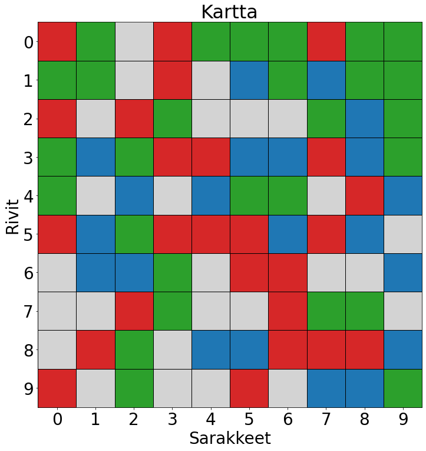
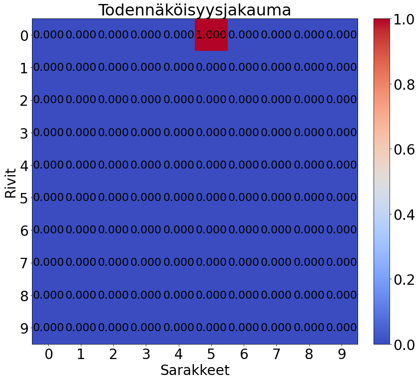

# Bayesian localization
This project is a Python simulation of a Bayesian localization scenario. The simulation demonstrates how Bayesian inference can be used to estimate the location of a vehicle on a grid map, based solely on its movements and color observations. The program is written in Finnish for a university course project on mathematical modeling.

## Scenario description
Imagine sitting inside a closed vehicle that is placed on a grid-like flat surface. The vehicle can move one step at a time either forward, backward, left, or right, but you cannot control its direction. With every step, you receive a color observation from the surface you're currently on. The colors can be blue, red, green, or the surface might be colorless. You also have a map of the area with each grid cell colored accordingly. However, you do not know your initial position or orientation relative to the map. Your goal is to determine your location on the map with as few steps as possible, keeping in mind that your memory only holds the last 10 steps. Additionally, there's a 0.001 probability that the color observation you receive might be incorrect. You do not need to consider reaching the edge of the grid area in this simulation.

## Implementation
The project is implemented in Python and utilizes matplotlib for visualization. The core functions are:

`havaitse(p, kartta, havainto, virhe)`: Updates the probabilities for each grid cell based on the latest color observation.

`liiku(p, liike)`: Moves the probability distribution according to the vehicle's motion.

`posteriorijakauma(kartta, havainnot, liikkeet, virhe)`: Determines the posterior distribution based on the observations and movements.

`piirra_kartta(kartta, p=None)`: Draws the grid map with optional probability overlays.

`visualisoi_jakauma(p)`: Visualizes the probability distribution using a color map.

`kaanna_liikkeet(liikkeet)`: Rotates the movement vectors by 90, 180, and 270 degrees to account for initial unknown orientation.

`yhdista_jakaumat(jakaumat)`: Combines multiple probability distributions and normalizes the result.

`satunnainen_kartta(rivit, sarakkeet)`: Generates a random grid map.

## Running the simulation
To run the simulation, simply clone the repository and execute the Python script. The script includes various commented sections for different grid sizes and scenarios. Uncomment the sections you wish to run and observe the output visualizations.

## Example usage
```
# Example: 10x10 grid map with specific movements and observations
kartta = [['R', 'G', 'E', 'R', 'G', 'G', 'G', 'R', 'G', 'G'],
          ['G', 'G', 'E', 'R', 'E', 'B', 'G', 'B', 'G', 'G'],
          ['R', 'E', 'R', 'G', 'E', 'E', 'E', 'G', 'B', 'G'],
          ['G', 'B', 'G', 'R', 'R', 'B', 'B', 'R', 'B', 'G'],
          ['G', 'E', 'B', 'E', 'B', 'G', 'G', 'E', 'R', 'B'],
          ['R', 'B', 'G', 'R', 'R', 'R', 'B', 'R', 'B', 'E'],
          ['E', 'B', 'B', 'G', 'E', 'R', 'R', 'E', 'E', 'B'],
          ['E', 'E', 'R', 'G', 'E', 'E', 'R', 'G', 'G', 'E'],
          ['E', 'R', 'G', 'E', 'B', 'B', 'R', 'R', 'R', 'B'],
          ['R', 'E', 'G', 'E', 'E', 'R', 'E', 'B', 'B', 'G']]  # Define the grid map
liikkeet = [[0,1],[1,0],[1,0],[0,1],[-1,0],[-1,0],[1,0],[-1,0],[0,1],[0,-1]]  # Define the movements
havainnot = ['G','E','E','B','B','G','B','G','G','G']  # Define the color observations
posteriori = posteriorijakauma(kartta, havainnot, liikkeet, 0.001)
piirra_kartta(kartta)
visualisoi_jakauma(posteriori)
```





## Contributions
This is an open project, and contributions are welcome. If you have ideas for improvement or want to adapt the project for more complex scenarios, feel free to fork the repository and submit pull requests.
